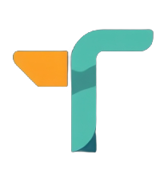

<p align="center">
  
</p>

# Taskaya Freelancing Platform

Taskaya is a modern freelancing platform inspired by Upwork, designed to connect clients with talented freelancers. In addition to standard freelancing features, Taskaya introduces the concept of **Communities**—enabling freelancers to form groups, collaborate, and collectively seek job opportunities.

## Features

- **Client & Freelancer Accounts:** Seamless onboarding for both clients and freelancers.
- **Job Posting & Bidding:** Clients can post jobs, and freelancers can submit proposals.
- **Community Groups:** Freelancers can create or join communities to collaborate and apply for jobs as a team.
- **Profile Management:** Rich profiles for both clients and freelancers, including skills, portfolios, and metrics.
- **Contracts & Milestones:** Structured workflow for managing contracts, milestones, and payments.
- **Notifications:** Real-time updates for proposals, contracts, and community activities.
- **Advanced Search:** Powerful search and filtering for jobs, freelancers, and communities.

## Tech Stack

- **Frontend Framework:** [Next.js](https://nextjs.org/)
- **Styling:** [Tailwind CSS](https://tailwindcss.com/)
- **Note:** This repository contains only the frontend code.

## Getting Started

To run the project locally:

```bash
npm install
npm run dev
```

Then open [http://localhost:3000](http://localhost:3000) in your browser.

## Folder Structure

- `app/` — Main application code (components, pages, styles, etc.)
- `public/` — Static assets and images
- `README.md` — Project documentation

## Contributing

Contributions are welcome! Please open an issue or submit a pull request for any improvements or bug fixes.

## License

[MIT](LICENSE) (or specify your license here)

## Contact

For questions or support, please contact the project maintainer.
